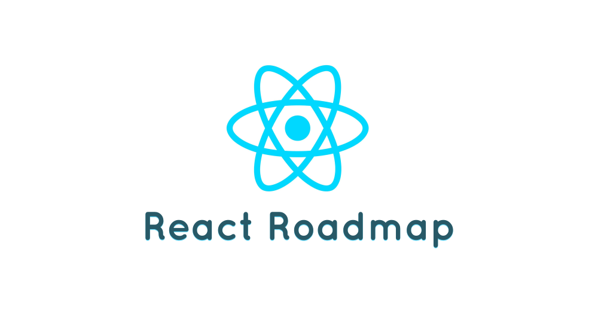

:link: A curated list of free resources to master React Development :sparkles:

## Table Of Contents
- [Motivation](#motivation)
- [Roadmap](#roadmap)
	- [Why React?](#why-react)
	- [React](#react)
	- [Bundlers](#bundlers)
	- [ES2015+](#es2015)
	- [Routing](#routing)
	- [Redux](#redux)
	- [Build Stuff](#build-stuff)
- [How To Use This Guide](#how-to-use-this-guide)
- [How To Colaborate](#how-to-colaborate)
- [Team](#team)
- [Inspiration And Additional Resources](#inspiration-and-additional-resources)

## Motivation
This project aims to collect the **best resources** for those that want to learn how to build applications with React and also understand the [concepts](https://github.com/reactjs/react-basic) behind it, like Functional Programming, Composition, Unidirectional Data Flow and many others.

## Roadmap
### Why React?
1. [JS Apps at Facebook](https://www.youtube.com/watch?v=GW0rj4sNH2w)
1. [Why did we build React?](https://facebook.github.io/react/blog/2013/06/05/why-react.html)
1. [React: Rethinking best practices](https://www.youtube.com/watch?v=x7cQ3mrcKaY)

### [React](https://facebook.github.io/react/)
1. [React Fundamentals](http://courses.reactjsprogram.com/courses/reactjsfundamentals)
1. [Getting Started](https://facebook.github.io/react/docs/getting-started.html)
1. [Getting Started with create-react-app](https://daveceddia.com/create-react-app-official-project-generator/)
1. [React Docs Tutorial](https://facebook.github.io/react/docs/tutorial.html)
1. [Thinking in React](https://facebook.github.io/react/docs/thinking-in-react.html)
1. [The React Quick Start Guide](http://www.jackcallister.com/2015/01/05/the-react-quick-start-guide.html) ([ES6 version](http://www.jackcallister.com/2015/08/30/the-react-quick-start-guide-es6-edition.html))
1. [Removing User Interface Complexity, or Why React is Awesome](http://jlongster.com/Removing-User-Interface-Complexity,-or-Why-React-is-Awesome)
1. [Learn Raw React — no JSX, no Flux, no ES6, no Webpack…](http://jamesknelson.com/learn-raw-react-no-jsx-flux-es6-webpack/)
1. [Learn Raw React: Ridiculously Simple Forms](http://jamesknelson.com/learn-raw-react-ridiculously-simple-forms/)
1. [Building a Router with Raw React](http://jamesknelson.com/routing-with-raw-react/)
1. [React's Official Guides](https://facebook.github.io/react/docs/why-react.html) & [Tips](https://facebook.github.io/react/tips/introduction.html)
1. [react-devtools](https://github.com/facebook/react-devtools)
1. [React Cheat Sheet](http://reactcheatsheet.com/)

### Bundlers
#### [Webpack](http://webpack.github.io/)
1. [Webpack your bags](https://blog.madewithlove.be/post/webpack-your-bags/)
1. [Webpack — The Confusing Parts](https://medium.com/@rajaraodv/webpack-the-confusing-parts-58712f8fcad9#.drs7xvnbi)
1. [SurviveJS - Webpack](http://survivejs.com/webpack/introduction/)

### ES2015+
1. [Learn ES6 (ECMAScript 2015)](https://egghead.io/courses/learn-es6-ecmascript-2015)
1. [Setting up ES6](https://leanpub.com/setting-up-es6/read)
1. [Overview of ECMAScript 6 features](https://github.com/lukehoban/es6features)
1. [Exploring ES6](http://exploringjs.com/es6/)
1. [Exploring ES2016 and ES2017](https://leanpub.com/exploring-es2016-es2017/read)

### Routing
1. [React Router Tutorial](https://github.com/reactjs/react-router-tutorial)

### Redux
1. [Getting Started with Redux](https://egghead.io/courses/getting-started-with-redux)
1. [Building React Applications with Idiomatic Redux](https://egghead.io/courses/building-react-applications-with-idiomatic-redux)

### Build Stuff
1. [Several project ideas](https://react.rocks/)
1. [React - TodoMVC](http://todomvc.com/examples/react/#/)
1. [Bootstrapping a React project](https://auth0.com/blog/bootstrapping-a-react-project/)
1. [The SoundCloud Client in React + Redux](http://www.robinwieruch.de/the-soundcloud-client-in-react-redux/)
1. A Primer on the React Ecosystem: [1](http://patternhatch.com/2016/07/06/a-primer-on-the-react-ecosystem-part-1-of-3/), [2](http://patternhatch.com/2016/08/02/a-primer-on-the-react-ecosystem-part-2-of-3/) and 3.
1. [Building a React/Redux App with JSON Web Token (JWT) Authentication](http://blog.slatepeak.com/build-a-react-redux-app-with-json-web-token-jwt-authentication/)

## How To Use This Guide
Use a **linear approach** to complete this guide. That means you should start with the first resource and pass to the next one after you finish the previous and after make a practical project to internalize what you have learned.

The React's ecosystem is overwhelming for beginners. Ensure to learn each new tool **isolatedly**.

Said this, our first course in the React section covers all the React ecosystem. Face this as a general introduction to each topic that will be studied deeply in the following sections.

## How To Colaborate
To suggest new sections or new resources, open an issue explaining why we should add/remove some resource/section. After at least 5 people approve (:+1:) your indication, you will be invited to create the pull request.

The reason to keep this way of collaboration is to ensure that our list of resources will be really concise, bringing only the best resources for those that want to master the topics listed here.

## Team
- **Rodmap creator**: [Eric Douglas](https://github.com/ericdouglas)
- **Rodmap maintainer**: [Eric Douglas](https://github.com/ericdouglas)

## Inspiration And Additional Resources
1. [You’re Missing the Point of React](https://medium.com/@dan_abramov/youre-missing-the-point-of-react-a20e34a51e1a#.qgt6xupid) 
1. [react-makes-you-sad](https://github.com/gaearon/react-makes-you-sad)
1. [react-howto](https://github.com/petehunt/react-howto)
1. [Your Timeline for Learning React](https://daveceddia.com/timeline-for-learning-react/)
1. [5 Steps for Learning React Application Development](http://developer.telerik.com/featured/5-steps-for-learning-react-application-development/)
1. [Path to Learning React](https://www.reddit.com/r/reactjs/comments/4r95aj/path_to_learning_react/)
